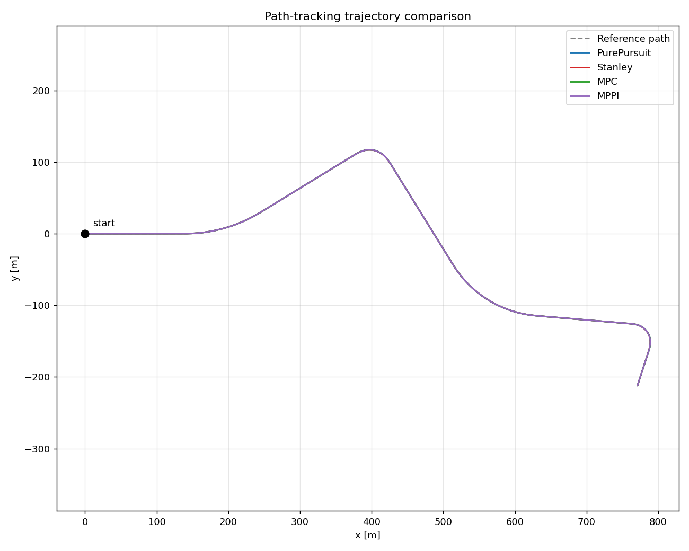
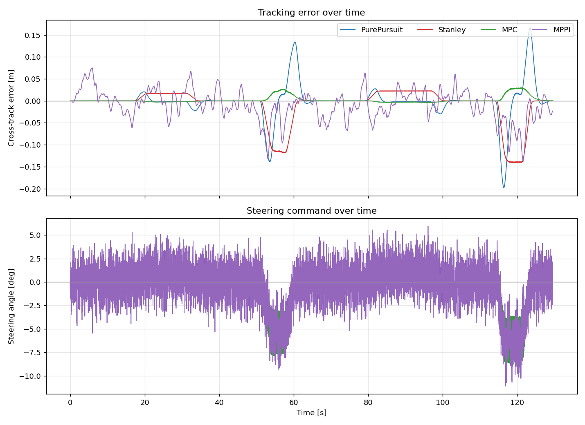
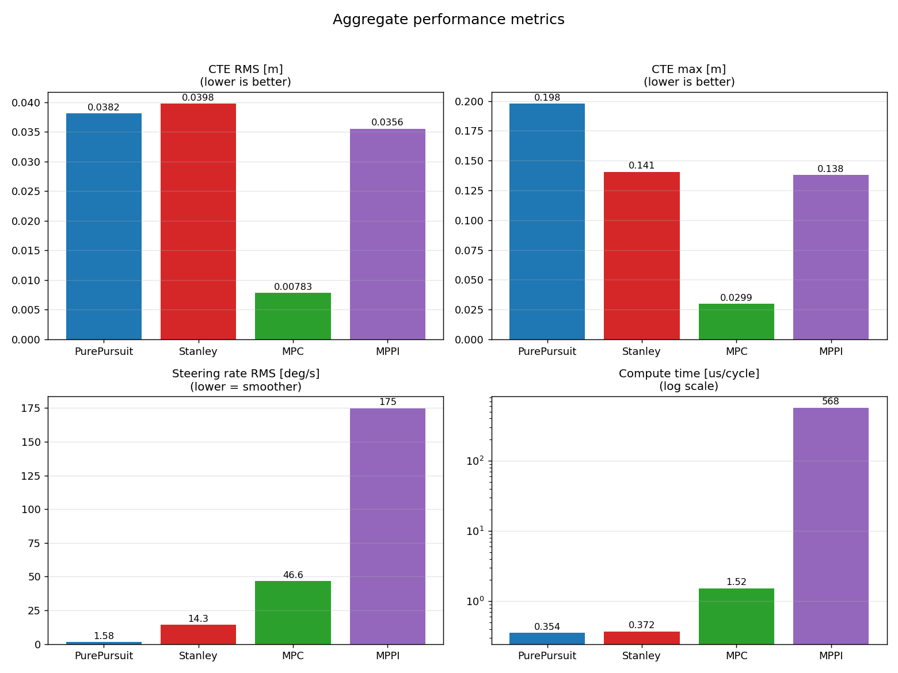

# 経路追従アルゴリズム比較レポート

本レポートでは、4 つの経路追従アルゴリズム — **Pure Pursuit**、**Stanley**、
**MPC**、**MPPI** — を、同一の約 1.0 km の基準経路上で同一の運動学的自転車
モデルを用いて比較します。4 手法はいずれも同じ縦方向（速度）の制御則を共有
しているため、比較では*操舵（横方向）*の挙動のみを切り分けて評価できます。

## 試験条件

| 項目 | 値 |
|------|-----|
| 基準経路 | `data/reference_route.csv` — 1871 点、1010.0 m、R = 200 / 30 / 150 / 25 m のカーブを含む |
| 車両モデル | 運動学的自転車モデル、ホイールベース 2.7 m |
| 制御周期 | 0.01 s（100 Hz） |
| 速度プロファイル | 曲率制限、1.5〜8.0 m/s（横加速度上限 1.5 m/s²） |
| 初速度 | 経路始点速度の 30 % |

## 結果

| アルゴリズム | CTE RMS [m] | CTE 最大 [m] | 方位 RMS [deg] | 操舵レート RMS [deg/s] | 平均速度 [km/h] | 計算時間 [µs/周期] | 完走 |
|-------------|-------------|--------------|----------------|------------------------|-----------------|--------------------|------|
| Pure Pursuit | 0.038 | 0.198 | 0.235 | **1.6** | 28.0 | **0.35** | はい |
| Stanley | 0.040 | 0.141 | 0.151 | 14.3 | 28.0 | 0.37 | はい |
| MPC | **0.008** | **0.030** | **0.115** | 46.6 | 28.0 | 1.52 | はい |
| MPPI | 0.036 | 0.138 | 0.384 | 174.8 | 28.0 | 568 | はい |

4 手法すべてが経路を完走し、いずれも誤差 0.2 m 以内に収まります。基準経路は
クロソイド緩和曲線で接続された曲率連続な経路であり、どのコントローラも曲率の
不連続を吸収する必要がないためです。この試験では **MPC が最も小さい横方向誤差
（cross-track error）** を達成し（他 3 手法の約 1/5）、**Pure Pursuit が最も
滑らかな操舵**を最小の計算コストで実現しました。

### 軌跡



地図スケールでは 4 つの軌跡は基準経路と区別がつきません — どのアルゴリズムも
経路を精度よく追従しています。

### 時間経過に伴う追従誤差と操舵



差が現れるのは 2 つの急カーブ、t ≈ 55 s（R = 30 m）と t ≈ 118 s（R = 25 m）
です。いずれの手法もピーク誤差は後者の最も急なカーブで発生します:

- **Pure Pursuit** はピーク誤差が最大（0.198 m）です。進入時に内側を切り、
  脱出時に外側へオーバーシュートします。横方向誤差に直接作用せず前方注視点へ
  操舵する方式の、古典的な帰結です。
- **Stanley** は定曲率区間で小さいながら*持続的な*オフセットを保ちます
  （R = 200 m の緩カーブで約 +0.017 m、R = 150 m で +0.023 m）。曲率
  フィードフォワード項を持たないため、円弧が要求する定常的な操舵量と釣り合う
  横方向誤差が残ります。
- **MPC** は全域でほぼ平坦です（ピーク 0.030 m）。予測ホライズンにより、誤差が
  現れる前からカーブへ向けて操舵を始められます。これはまさに幾何的手法が
  表現できない挙動です。
- **MPPI** は平均的にはよく追従しますが、軌跡は目に見えてノイジーです
  （直線区間で ±0.05 m）。確率的サンプリングの直接的な現れです。

### 集約指標



## 考察

| アルゴリズム | 観測された強み | 観測されたトレードオフ |
|-------------|----------------|------------------------|
| **Pure Pursuit** | 最も単純。操舵が圧倒的に滑らか（操舵レート RMS 1.6 deg/s）。計算コスト最小。 | 急カーブでのピーク誤差が最大 — 進入時のショートカットと脱出時のオーバーシュート。横方向誤差の直接フィードバックがない。 |
| **Stanley** | 低い計算コスト。急カーブでの挙動は Pure Pursuit より良好（CTE 最大が小さい）。横方向誤差と方位誤差を直接補正。 | 定曲率区間で定常オフセットが残る。操舵が Pure Pursuit よりやや忙しい。 |
| **MPC** | 追従精度が約 5 倍良好。ホライズンにより曲率を先読みできる。誤差と制御量を同時に重み付け。 | 幾何的手法より操舵動作が活発。モデルと Riccati 求解が必要（Eigen 依存）。 |
| **MPPI** | 非凸／微分不可能なコストを扱える。精度は幾何的手法と同等。自然に並列化可能。 | 計算コストが群を抜いて高い。操舵が最もノイジー。結果がサンプル数と温度パラメータに依存。 |

### まとめ

- 曲率連続な滑らかな経路と運動学的モデルにおいては、4 手法とも絶対値としては
  高精度です（ピーク誤差 0.2 m 未満）。着目すべきは「追従できるか」ではなく
  *どう崩れるか* — Pure Pursuit はカーブでのピーク、Stanley は円弧上の定常
  オフセット、MPPI はサンプリングノイズ、という違いです。
- **MPC** が精度で勝るのは、経路曲率が事前に既知である以上、反応的な幾何より
  予測ホライズンのほうが有利だからです。本ベンチマークが行使できる数少ない
  MPC の利点です。
- **MPPI** の汎用性（非凸／微分不可能なコスト）は、単一経路・運動学的な本
  ベンチマークでは行使されないため、ここではコストのみを支払う形になります。
  この単一スレッドの参照ビルドでは 1 周期あたり幾何的手法の約 1600 倍です。

## 再現方法

```bash
python tools/generate_reference_route.py     # 任意（CSV はリポジトリに同梱済み）
cmake -S . -B build -DCMAKE_BUILD_TYPE=Release
cmake --build build -j
cd build && ./path_tracking_compare
python ../tools/plot_results.py . ../data/reference_route.csv
```

数値はコンパイラ、最適化フラグ、CPU により多少変動します。MPPI は固定の乱数
シードを用いるため、その軌跡は再現可能です。
